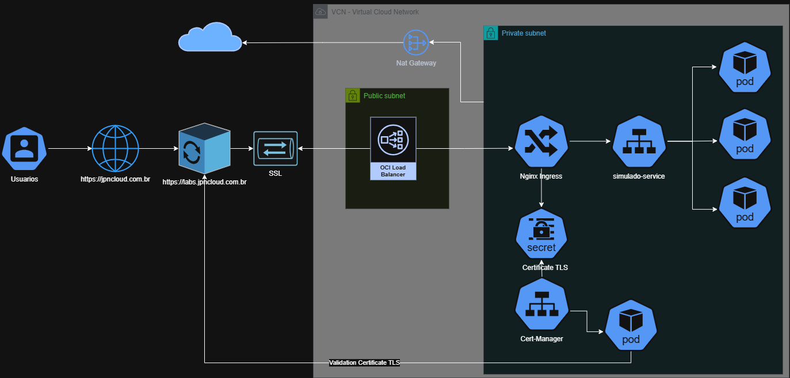

# 🚀 OCI JPN Labs Infrastructure

[](https://www.oracle.com/cloud/)
[](./terraform)
[](./k8s)
[](./LICENSE)
[](https://jpncloud.com.br)

---

## 📌 Sobre o Projeto

O **JPN Labs** é uma plataforma de alta performance, orquestrada em **Kubernetes (OKE)**, criada pela **JPN Cloud Solutions** para **laboratórios e validação de skills em Cloud**.  

Este repositório traz o **esqueleto de Infraestrutura como Código (IaC)** para provisionamento na **Oracle Cloud Infrastructure (OCI)**. O projeto segue **melhores práticas de modularização, segurança e governança**, sendo um **blueprint confiável** para estudos ou projetos reais.

> **Status do Projeto:** v0.3 — Running on OCI Kubernetes (3 replicas) 🟢

---

## 🗺️ Topologia do Projeto



> Para o diagrama completo, veja [topologia.drawio](docs/topologia.drawio)

## 🚧Arquitetura e Organização

O projeto está dividido em camadas para garantir a separação de responsabilidades e facilitar a manutenção:

```text
terraform-oci-jpn-labs-engine/
├─ config/          # Definições globais e políticas
├─ kubernetes/      # Manifestos e configurações do cluster (OKE)
├─ terraform/       # Módulos de Infraestrutura
│  ├─ compute/      # Instâncias (Always Free E2.1.Micro)
│  ├─ network/       # VCN, Subnets e Security Lists
│  └─ security/      # Políticas de IAM e Vault
└─ README.md
```
## 🛠️ Principais Tecnologias

* **Terraform** – IaC modularizado para provisionamento seguro e rápido.  
* **OCI OKE** – Kubernetes gerenciado para microserviços escaláveis.  
* **Cloudflare** – DNS, CDN e WAF para segurança e performance do Frontend.  

---

## 🛡️ Segurança e Governança (Repositório Público)

Para evitar exposição de dados sensíveis, seguimos algumas diretrizes:

* **Sem credenciais** – Arquivos `*.tfvars`, `*.pem` e `*.key` estão no `.gitignore`.  
* **Backend seguro** – `backend.tf` e `data.tf` ficam apenas em ambiente local ou repositórios privados.  
* **Código modular** – Permite reutilização como blueprint em outros projetos.  

> 💡 Dica: versionar apenas módulos e manifests essenciais, sem expor segredos.

---

## 🚀 Como Utilizar

1. **Clone o repositório**:
    ```bash
    git clone https://github.com/JP-Neto/terraform-oci-jpn-labs-engine.git
    ```

2. **Configure suas variáveis e acesso**:  
   Crie o arquivo `terraform.tfvars` baseado no`variables.tf`, e configure seus arquivos de acesso `backend.tf` e `data.tf` localmente.

3. **Configure o Backend**:  
   Pode ser local ou remoto (OCI Object Storage).

4. **Inicie o Terraform**:
    ```bash
    terraform init
    terraform validate
    terraform plan
    terraform apply
    ```

> ⚠️ Lembre-se: **não versionar segredos nem certificados**.

---

## 📂 Estrutura de Módulos Terraform

<details>
<summary>📂 Clique para expandir</summary>

```text
terraform/
├─ compute/       # Instâncias e recursos
│  ├─ main.tf
│  ├─ variables.tf
│  └─ outputs.tf
├─ network/       # VCN, Subnets, Internet Gateway, Security Lists
│  ├─ main.tf
│  ├─ variables.tf
│  └─ outputs.tf
└─ security/      # Políticas IAM e Vault
   ├─ main.tf
   ├─ variables.tf
   └─ outputs.tf

```
</details>

## 📦 Kubernetes (OKE) Resources

* **Deployments** – Pods e réplicas.  
* **Services** – NodePort, ClusterIP ou LoadBalancer.  
* **Ingress** – Regras de roteamento via Nginx ou ALB.  

> 💡 Pode usar este repositório como **template** para qualquer cluster OCI/Kubernetes.

---

## 🔗 Links Úteis

* [Documentação OCI](https://docs.oracle.com/en-us/iaas/Content/home.htm)  
* [Terraform OCI Provider](https://registry.terraform.io/providers/oracle/oci/latest/docs)  
* [Kubernetes Official Docs](https://kubernetes.io/docs/)  
* [Cloudflare Docs](https://developers.cloudflare.com/)  
* [LinkedIn](https://linkedin.com/in/josepneto) 
* [Site Oficial](https://jpncloud.com.br) 
* [JPN Labs](https://labs.jpncloud.com.br)

---


<p align="center">
  &copy; 2026 JPN Cloud Solutions • João Pessoa/PB • Architecting resilient cloud platforms
</p>

